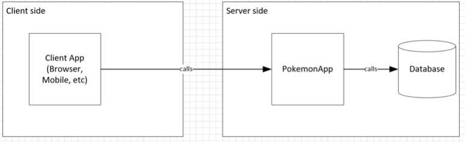
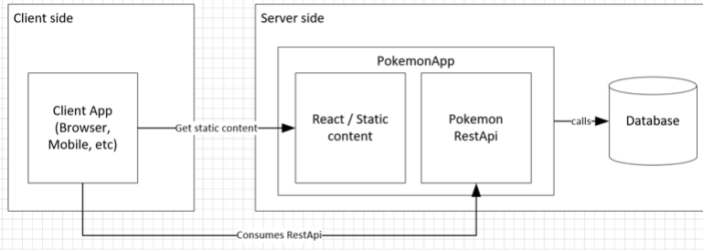
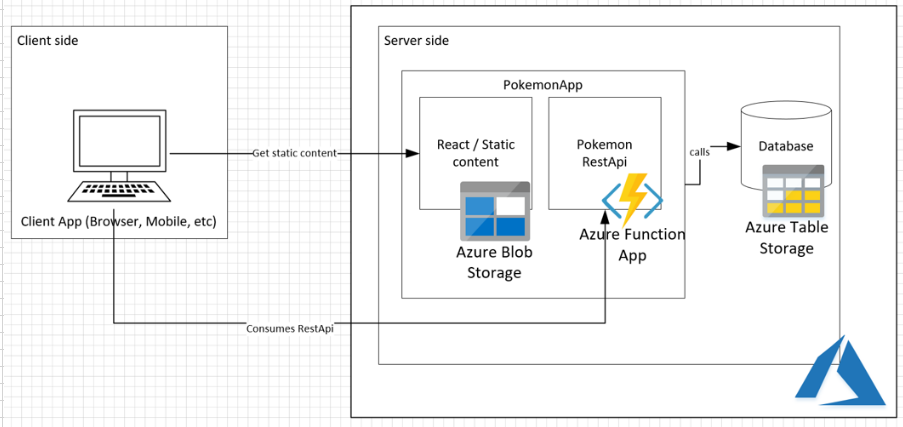

# Project 🛠️

**Goal**🎯: Create a Pokemon management application aka Pokedex. In this application the user should be allowed to managed Pokemons, their powers and other characteristics that you think would be good the save, use your imagination.
The main porpuse is to build a web based application using moderns technologies and best practices.

**Datamodel**:

|  Pokemon Entity    | Values and relevant information                                                                                                           |
|--------------------|-------------------------------------------------------------------------------------------------------------------------------------------|
| 'pokemonName' (pk) | str                                                                                                                                       |
| 'pokedexNumber'    | positive integer                                                                                                                          |
| 'pokemonType'      | (str) - 'normal','fire', 'water', 'grass', 'electric', 'ice', 'fighting', 'poison', 'flying', 'bug', 'psychic', 'ghost', 'dark', 'dragon' |
| 'pokemonColor'     | (str) - 'red', 'green' ,'blue', 'yellow', 'black', 'white', 'purple', 'orange', 'pink'                                                    |
| 'pokemonAttacks'   | [str]                                                                                                                                     |

* **Datamodel Rules**:
    * A Pokemon can have more than one PokemonAttack;
    * The 'pokemonName' is unique, we can't have two pokemons with the same name;
    * The 'pokedexNumber' is unique, we can't have two pokemons with the same number;
    * The 'pokemonColor' and 'pokemonType' are finite values (examples are given in table above).

**Business Rules**
* A web application, accessible from a web browser;
* Data should persist and not disappear when the application is restarted;
* Application accessible from anywhere in the world;
* It should be possible to create, read, update and delete a Pokemon and it's attacks.

**Architecture**

